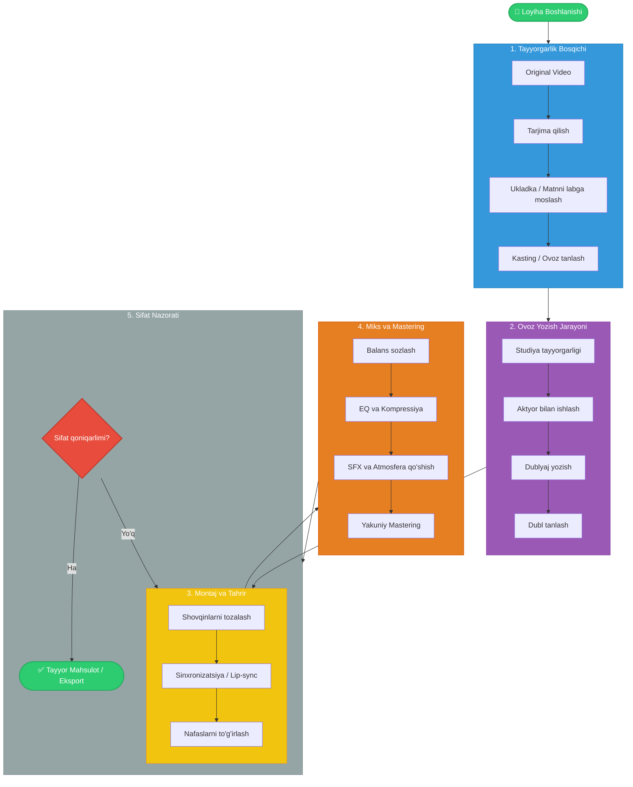

# Professional Dublyaj Loyihasi Schemasi

Ushbu hujjat professional darajada dublyaj studiyasi yoki loyihasini tashkil qilish uchun to'liq yo'l xaritasini (schema) taqdim etadi.

## 1. Loyiha Papkalar Tuzilmasi (Folder Structure)

Fayllarni tartibli saqlash uchun quyidagi papkalar tizimini yaratish tavsiya etiladi:

```
/Dublyaj_Loyihasi
│
├── /01_Original_Materiallar    # Asl video va audio fayllar (Source)
│   ├── Video_Clean            # Ovozsiz yoki toza video
│   ├── Audio_Original         # Asl ovoz yo'laklari
│   └── Scripts_Original       # Asl tildagi ssenariylar
│
├── /02_Hujjatlar              # Loyiha hujjatlari
│   ├── Tarjimalar             # O'zbek tiliga tarjima qilingan matnlar
│   ├── Sinxron_Matn           # "Ukladka" qilingan (labga tushadigan) matnlar
│   └── Kasting_Royxati        # Ovoz beruvchi aktyorlar ro'yxati
│
├── /03_Ovoz_Yozish            # Xom ovoz yozuvlari (Raw Recording)
│   ├── Personaj_1             # Har bir personaj uchun alohida
│   ├── Personaj_2
│   └── Ommaviy_Sahnalar       # Guruh bo'lib yozilgan ovozlar
│
├── /04_Montaj_Jarayoni        # DAW (Digital Audio Workstation) loyiha fayllari
│   ├── ProTools_Session       # Yoki Adobe Audition / Reaper loyihalari
│   └── Effektlar (SFX)        # Qo'shimcha tovush effektlari
│
├── /05_Miks_va_Mastering      # Yakuniy ovoz islovi
│   ├── Musiqa_Fon             # Orqa fon musiqalari (agar alohida bo'lsa)
│   └── Yakuniy_Miks           # Tayyor ovoz fayli (WAV/MP3)
│
└── /06_Tayyor_Mahsulot        # Render qilingan video va audio
    ├── Video_Final            # Yopishtirilgan video
    └── Eksport_Formatlar      # TV, YouTube yoki Kinoteatr uchun formatlar
```

## 2. Texnik Ta'minot (Technical Stack)

Professional sifatni ta'minlash uchun minimal talablar:

### Uskunalar (Hardware)
*   **Mikrofon:** Kondensatorli mikrofon (masalan, Neumann TLM 103, Rode NT1-A).
*   **Audio Interfeys:** Yuqori sifatli preampli (masalan, Universal Audio Apollo, Focusrite Scarlett).
*   **Quloqchinlar (Headphones):** Yopiq turdagi (Closed-back) studiya quloqchinlari (masalan, Beyerdynamic DT 770 Pro).
*   **Izolyatsiya:** Ovoz yutuvchi kabina yoki akustik panellar (Room Treatment).
*   **Kompyuter:** Kuchli protsessor va yetarli RAM (kamida 16GB) bilan.

### Dasturiy Ta'minot (Software / DAW)
*   **Ovoz Yozish va Montaj:** Pro Tools (standart), Adobe Audition, Reaper, yoki Nuendo.
*   **Video Pleyer:** Ovoz yozish paytida videoni ko'rish uchun (masalan, Video Slave yoki DAW ichidagi video engine).
*   **Plaginlar:** iZotope RX (shovqinni tozalash), FabFilter (EQ, Kompressor).

## 3. Ish Jarayoni Bosqichlari (Workflow)

Dublyaj jarayoni 5 asosiy bosqichdan iborat:

### I. Tayyorgarlik (Pre-production)
1.  **Tarjima (Translation):** Asl manbadan so'zma-so'z yoki badiiy tarjima.
2.  **Ukladka (Adaptation/Lip-sync):** Tarjima qilingan matnni aktyorning lab harakatlariga (artikulyatsiya) va vaqtiga moslash. Bu eng muhim bosqichlardan biri.
3.  **Kasting (Casting):** Personaj xarakteriga mos ovoz sohiblarini (aktyorlarni) tanlash.

### II. Ovoz Yozish (Recording)
1.  **Dublyaj rejissyori ishi:** Aktyorga hissiyot, intonatsiya va tempni tushuntirish.
2.  **Yozish jarayoni:** Har bir personaj alohida yo'lakka (track) yozib olinadi (Loop recording usuli keng qo'llaniladi).
3.  **Texnik nazorat:** Ovoz rejissyori "clipping" (ovoz portlashi) va shovqinlarni nazorat qiladi.

### III. Montaj (Editing)
1.  **Tozalash:** Nafas olish, duduqlanish va ortiqcha shovqinlarni olib tashlash.
2.  **Sinxronizatsiya:** Ovozni lab harakatiga millisekundigacha to'g'irlash (Time stretching/warping).

### IV. Miks va Mastering (Mixing & Mastering)
1.  **Balans:** Ovoz, musiqa va effektlar (SFX) balansini to'g'irlash.
2.  **EQ va Kompressiya:** Ovozni tiniqlashtirish va bir xil balandlikka keltirish.
3.  **Atmosfera:** Videodagi muhitga mos reverbsiya (reverb) va fazo (spatial audio) effektlarini qo'shish.

### V. Yakuniy Tekshiruv (QC - Quality Control)
1.  **Ko'rik:** Tayyor videoni boshidan oxirigacha ko'rib chiqish.
2.  **Eksport:** Kerakli formatda (Stereo 2.0 yoki Surround 5.1) chiqarish.

## 4. Jamoa Tarkibi (Team Roles)

*   **Loyiha Menejeri:** Muddatlar va byudjetni nazorat qiladi.
*   **Tarjimon:** Matnni o'zbek tiliga o'giradi.
*   **Ukladkachi (Adaptatsiya ustasi):** Matnni labga moslaydi.
*   **Dublyaj Rejissyori:** Aktyorlar bilan ishlaydi, ijodiy jarayonni boshqaradi.
*   **Ovoz Rejissyori (Sound Engineer):** Texnik yozish va montaj ishlari uchun javobgar.
*   **Aktyorlar:** Professional dublyaj aktyorlari.

## 5. Sifat Standartlari (Quality Metrics)

*   **Sinxronlik:** Ovoz lab harakati bilan kamida 95% mos tushishi kerak.
*   **Aniqlik:** Diksiya toza, so'zlar tushunarli bo'lishi shart.
*   **Aktyorlik mahorati:** Hissiyotlar "soxta" eshitilmasligi kerak.
*   **Texnik sifat:** -23 LUFS (TV standarti) yoki -14 LUFS (Web standarti) balandlik normalariga rioya qilish.

## 6. Vizual Schema (Visual Workflow)

Quyida jarayonning vizual chizmasi keltirilgan (Mermaid diagrammasi):



